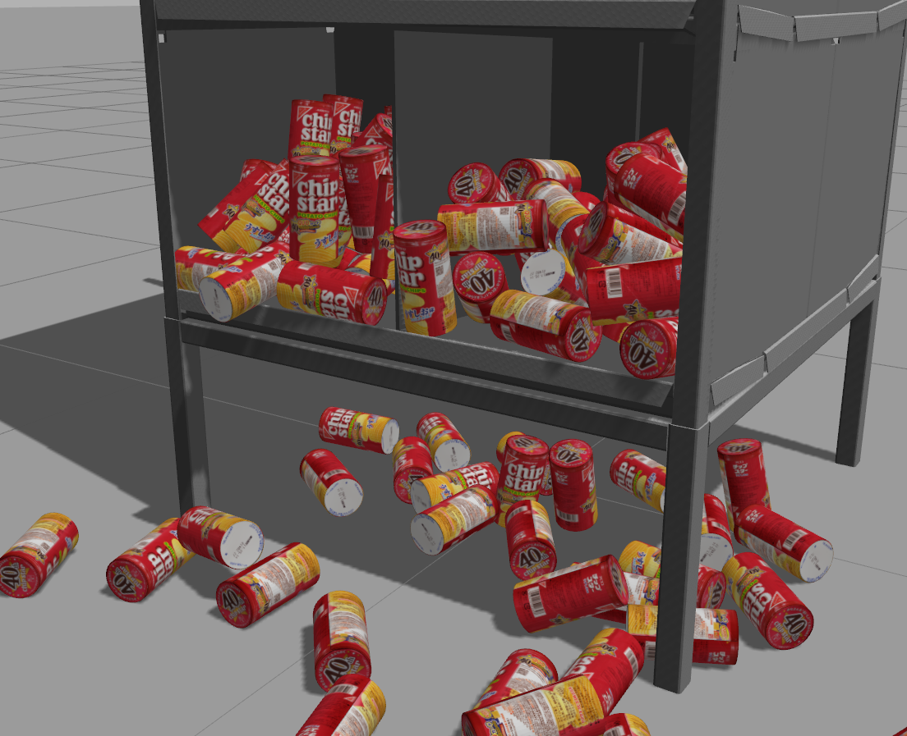

# Gazeboでチップスターをたくさん置くやつ



## モデルを所定の場所に

`.gazebo/models`にこのレポジトリの`models`の中身をコピーする．

## Gazeboを起動
`.world`ファイルを指定する．

```bash
gazebo chip_star_gazebo/script/chip_star.world
```

## pythonコード

```bash
sudo pip install jinja2
cd script
python genenrate.py
```

チップスターをたくさん置きたいと思った時の補助スクリプト．